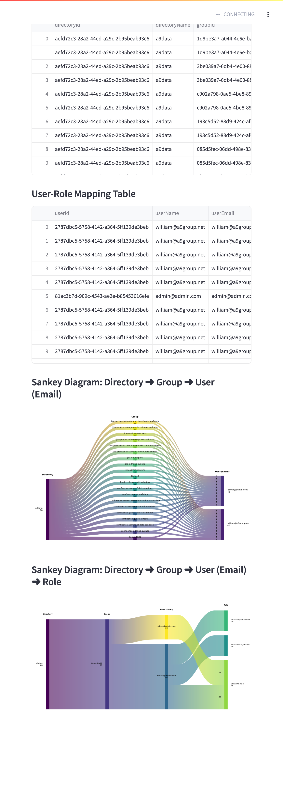

# A9 Hierarchy Crawler & Sankey View

This tool helps Jira admins, compliance teams, and stakeholders **visualize, report, and audit** access within your Atlassian organization.


---

## ✏️ **What It Does**

✅ **Crawls your Atlassian organization hierarchy**
✅ Builds a complete map of:

* Directories
* Groups
* Users (with email as the key label)
* Roles (including platform-level roles like `org-admin` and `site-admin`)

✅ **Produces:**

* Interactive **Sankey diagrams** for visual insights
* Downloadable **CSV and JSON** data
* A **snapshot file** (`hierarchy_data.json`) to save your progress and quickly resume crawls

---

## 📦 **Setup**

1️⃣ **Secrets file (recommended)**
Create a `.streamlit/secrets.toml`:

```toml
[api]
api_key = "YOUR_ATLASSIAN_API_KEY"
org_id = "YOUR_ORGANIZATION_ID"
```

2️⃣ **Or provide these interactively** in the app’s sidebar if the secrets file isn’t present.

3️⃣ Install dependencies:

```bash
pip install -r requirements.txt
```

---

## 🚀 **Run the App**

```bash
streamlit run app.py
```

---

## 📊 **Output & Downloads**

* **Tables:** Hierarchy and user-role mappings
* **Sankey diagrams:**

  * `Directory ➜ Group ➜ User (Email)`
  * `Directory ➜ Group ➜ User (Email) ➜ Role`
* **Download:** CSV and JSON for offline analysis
* **Snapshot:** `hierarchy_data.json` – delete this file to start fresh:

```bash
rm hierarchy_data.json
```

---

## ⚙️ **Why It Matters**

> **Audit failures carry steep penalties—fines, lost contracts, reputational damage.**
> This app helps you **continuously** visualize and document access for better compliance and proactive risk management.
